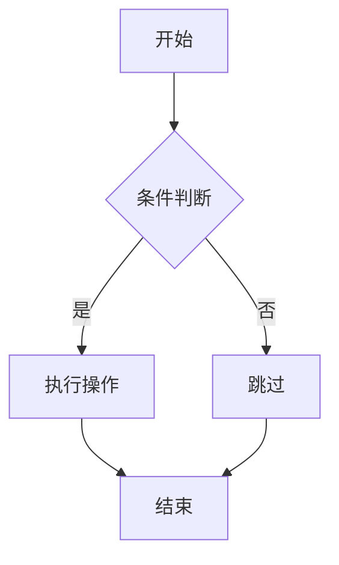
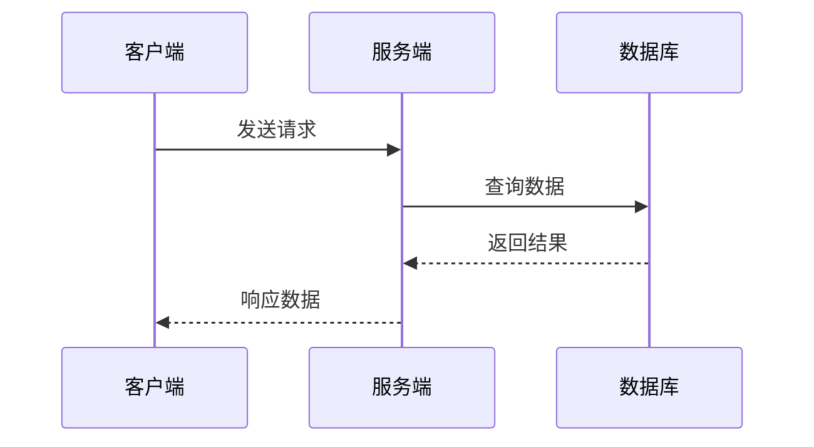
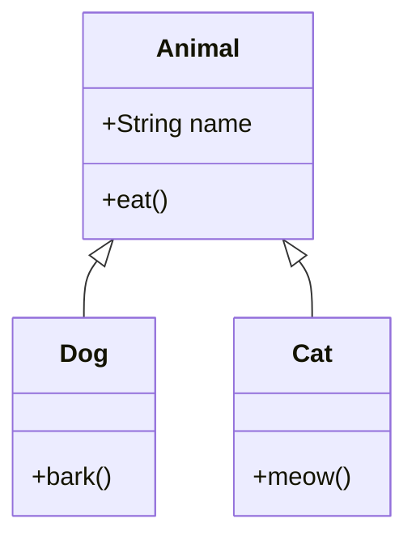
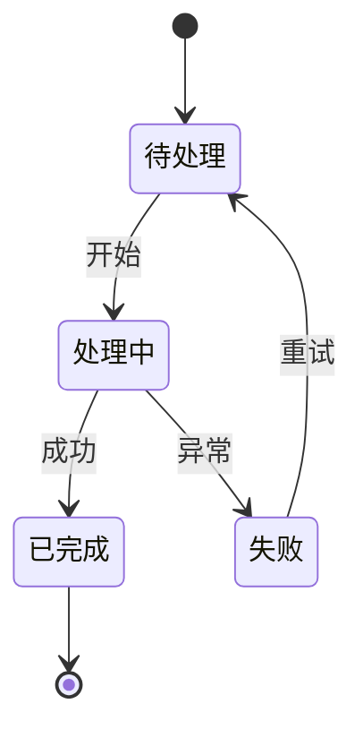

## 流程图
````
graph TD
    A[开始] --> B{条件判断}
    B -->|是| C[执行操作]
    B -->|否| D[跳过]
    C --> E[结束]
    D --> E
````



## 时序图
````
sequenceDiagram
    客户端->>服务端: 发送请求
    服务端->>数据库: 查询数据
    数据库-->>服务端: 返回结果
    服务端-->>客户端: 响应数据
````



## 类图
````
classDiagram
    Animal <|-- Dog
    Animal <|-- Cat
    Animal : +String name
    Animal : +eat()
    Dog : +bark()
    Cat : +meow()
````



## 状态图
````
stateDiagram-v2
    [*] --> 待处理
    待处理 --> 处理中 : 开始
    处理中 --> 已完成 : 成功
    处理中 --> 失败 : 异常
    失败 --> 待处理 : 重试
    已完成 --> [*]
````


